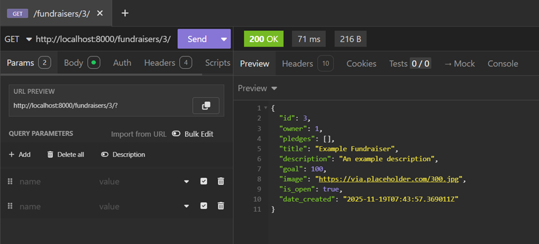
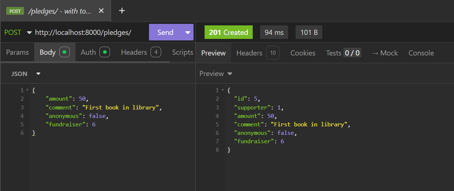
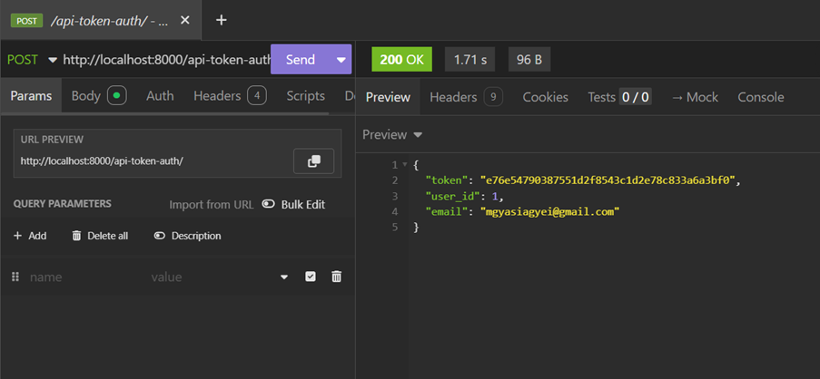
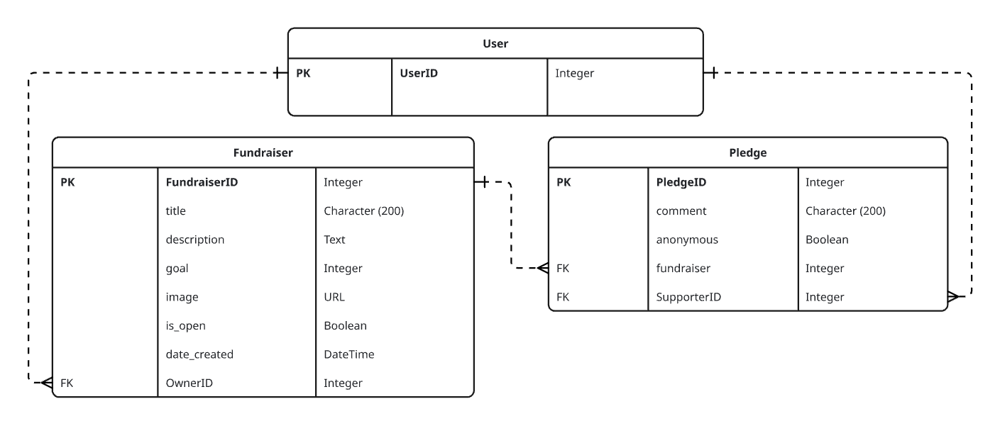

# Crowdfunding Back End
Michaela Gyasi-Agyei

Link to deployed project: https://pakyi-library-fundraiser-5eb04ac099ec.herokuapp.com/fundraisers/

## Table of contents
- [Crowdfunding Back End](#crowdfunding-back-end)
  - [Table of contents](#table-of-contents)
  - [Planning:](#planning)
    - [Concept/Name](#conceptname)
    - [Intended Audience/User Stories](#intended-audienceuser-stories)
  - [Insomnia Screenshots](#insomnia-screenshots)
  - [Example instructions](#example-instructions)
    - [Step 1: Register a New User](#step-1-register-a-new-user)
    - [Step 2: Get Authentication Token](#step-2-get-authentication-token)
    - [Step 3: Create a New Fundraiser](#step-3-create-a-new-fundraiser)
  - [API Spec](#api-spec)
  - [DB Schema](#db-schema)

## Planning:
### Concept/Name
My website concept is a crowdfunding site called Sankofa Shelves which allows people to contribute to the purchase of books relating to Africa and the diaspora. These books will be included in libraries in the Ghanaian town of Pakyi, other Ghanaian towns or cities, and cities in other African countries. 

### Intended Audience/User Stories
My intended audience is anyone who is interested in literature, education and African culture. An example user may be a person with African heritage living overseas who wants to contribute to a library in their family's hometown by pledging an amount to a fundraiser. Another example user may be a teacher based in Ghana who wants to create a fundraiser to raise more funds for books in their school's library.

## Insomnia Screenshots

A screenshot of Insomnia, demonstrating a successful GET method for the /fundraisers/3/ endpoint.

A screenshot of Insomnia, demonstrating a successful POST method for the /pledges/ endpoint.

A screenshot of Insomnia, demonstrating a token being returned.

## Example instructions
To register a new user and create a new fundraiser, the following steps can be followed as an example.
### Step 1: Register a New User
        
    Select POST as the HTTP request method and include the following URL: http://localhost:8000/users/
        
    Include the following as the JSON body:
        {
          "username": "kweku_anansi",
          "email": "kwekuanansi@gmail.com",
          "password": "adinkra+233"
        }
        
    Press the "Send" button.

    The HTTP response should be "201 Created", with the following JSON:
        {
          "id": 1,
          "last_login": null,
          "is_superuser": false,
          "username": "kweku_anansi",
          "first_name": "",
          "last_name": "",
          "email": "kwekuanansi@gmail.com",
          "is_staff": false,
          "is_active": true,
          "date_joined": "2025-12-02T08:19:12.209141Z",
          "groups": [],
          "user_permissions": []
        }
        
### Step 2: Get Authentication Token
        
    Select POST as the HTTP request method and include the following URL: http://localhost:8000/api-token-auth/
        
    Include the following as the JSON body:
        
        {
          "username": "kweku_anansi",
          "password": "adinkra+233"
        }

    Press the "Send" button.
        
    The HTTP response should be "200 OK", with the following JSON:

        {
          "token": "f76e54790387551d2f8543c1d2e78c833"
          "user_id": 1,
	        "email": "kwekuanansi@gmail.com"
        }
        
### Step 3: Create a New Fundraiser
        
    Select POST as the HTTP method and include the following URL: http://localhost:8000/fundraisers/

    Select the "Auth" tab and then select "Bearer Token" as the authentication method. Include the following authentication details:
      
        Token: f76e54790387551d2f8543c1d2e78c833
        Prefix: Token
        
    Include the following as the JSON body:

        {
          "title": "First fundraiser",
          "description": "First collection of books in Pakyi library",
          "goal": 100,
          "image": "https://via.placeholder.com/300.jpg",
          "is_open": true
        }
        
        Press the "Send" button.
        
        The HTTP response should be "201 Created", with the following JSON:

        {
          "id": 1,
          "title": "First fundraiser,
          "description": "First collection of books in Pakyi library",
          "goal": 100,
          "image": "https://via.placeholder.com/300.jpg",
          "is_open": true,
          "date_created": "2025-12-02T08:19:12.209141Z",
          "owner": 1
        }

## API Spec

| URL | HTTP Method | Purpose | Request Body | Success Response Code | Authentication/Authorisation |
| --- | ----------- | ------- | ------------ | --------------------- | ---------------------------- |
| http://localhost:8000/users/ | POST | Create new user | {"username": "[insert username]", "email": "[insert email]", 	"password": "[insert password]"} | 201 CREATED | N/A   
| http://localhost:8000/users/ | GET | View all existing users | N/A | 200 OK | N/A |   
| http://localhost:8000/api-token-auth/ | POST | Return token | {  "username": "[insert username]", "password": "[insert password]"  } | 200 OK | N/A |  
| http://localhost:8000/fundraisers/ | POST | Make a new fundraiser | {  "title": "Example Fundraiser", "description": "[insert description]", "goal": [insert goal], "image": "[insert image location]", "is_open": [insert true or false]  } | 201 CREATED | Bearer token |  
 | http://localhost:8000/fundraisers/ | GET | View all existing fundraisers | N/A | 200 OK | N/A |  
 | http://localhost:8000/fundraisers/{pk} | GET | View a specific fundraiser | N/A | 200 OK | N/A |   
 | http://localhost:8000/pledges/ | POST | Make a new pledge |{  "amount": [insert pledge amount], "comment": [insert comment for pledge], 		"anonymous": [true or false], "fundraiser" [insert fundraiser ID]  } | 201 CREATED | Bearer token |  
| http://localhost:8000/pledges/ | GET | View all existing pledges | N/A | 200 OK | N/A |  
| http://localhost:8000/pledges/{pk}/ | GET | View a specific pledge | N/A | 200 OK | N/A |
| http://localhost:8000/pledges/{pk}/| DELETE | Delete a specific pledge | N/A | 204 NO CONTENT | Bearer token |  
| http://localhost:8000/fundraisers/{pk}/ | DELETE | Delete a specific fundraiser | N/A | 204 NO CONTENT | Bearer token |  
| http://localhost:8000/pledges/{pk}/ | PUT | Update a specific pledge | {  "amount": [insert pledge amount], "comment": [insert comment for pledge], 		"anonymous": [true or false], "fundraiser" [insert fundraiser ID]  } | 200 OK | Bearer token |  
| http://localhost:8000/fundraisers/{pk}/ | PUT | Update specific fundraiser | {  "title": "Example Fundraiser", "description": "[insert description]", "goal": [insert goal], "image": "[insert image location]", "is_open": [insert true or false]  } | 200 OK | Bearer token |  

## DB Schema

Database schema, showing the relationships between users, fundraisers and pledges